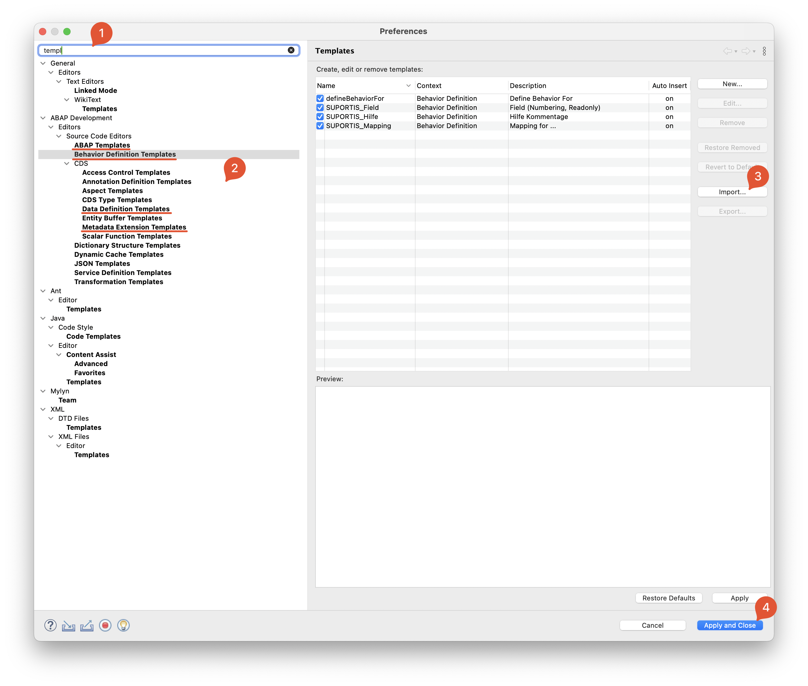

# Templates in Eclipse einfügen

- Einstellungen in Eclipse öffnen
- (1) nach `templ` suchen
- (2) je nach Datei entsprechenden Punkt auswählen
- (3) `Import` anklicken und Datei öffnen
- Punkt 2, 3 für die anderen 3 Dateien wiederholen
- (4) am Ende `Apply and Close` klicken

Templates werden bei Eclipse scheinbar beim beenden gespeichert! Daher am besten Eclipse beenden und neu starten da ein Speichern beim schließen der VPN nicht mehr möglich ist.

